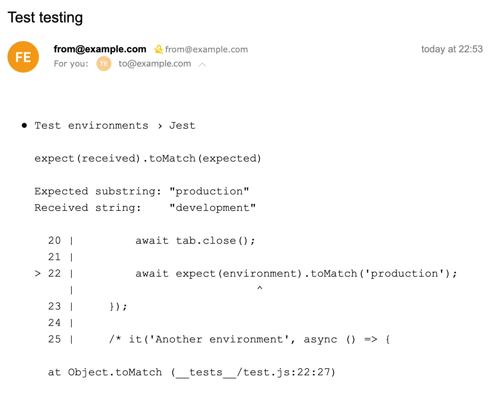

<div align="center">
  
  <h1>jest-email-reporter</h1>
  <p>See jest test errors on e-mail</p>
</div>

## Install

```sh
npm install --save-dev jest-email-reporter
# or
yarn add -D jest-email-reporter
```

## Usage

You must configure the jest config. Do not forget `from` and `to` e-mail addresses.

```javascript
{
    reporters: [
        "default",
        ["jest-email-reporter", {
            from: 'from@example.com',
            to: 'to@example.com',
            subject: 'Optional subject', // optional
            reportIfSuccess: true, // optional, default is false; it send e-mail message if tests were successful
        }]
    ]
}
```

## Result


